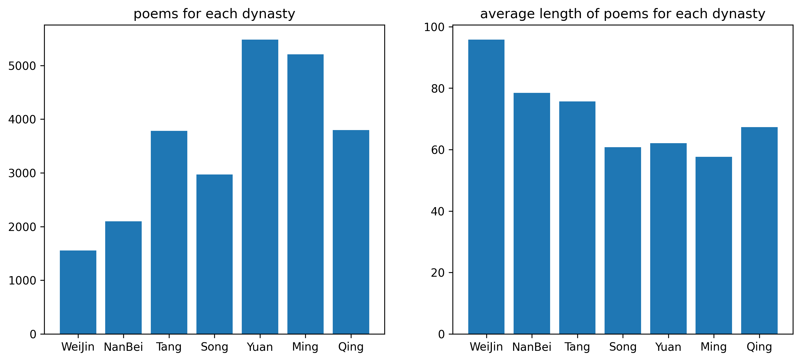

# Outils-de-Traitement-de-Corpus

**Classification poème-dynastie**

Ce projet s'inscrit dans le cadre du cours "Outils de Traitement de Corpus" du Master 1 Plurital.

## Gestion de l'environnement

Ce projet utilise `uv` pour la gestion de l'environnement.

Pour exécuter les scripts (assurez-vous d'avoir installé `uv`):
```bash
uv run chemin/vers/le/script.py
```

## Objectif du projet

L'objectif de ce projet est d'effectuer une classification textuelle sur un corpus de poèmes chinois classiques (à l'exclusion des formes *ci(词)* et *qu(曲)*). Le but est de prédire la dynastie (par ordre chronologique : WeiJin 魏晋, NanBei 南北朝, Tang 唐, Song 宋, Yuan 元, Ming 明, Qing 清) à laquelle un poème donné appartient.

Bien que les formes de la poésie chinoise classique soient restées relativement stables après la dynastie Tang, ce projet s'inspire de deux observations principales :

1.  **Linguistique** : Les caractéristiques linguistiques et l'usage des mots présentent des variations distinctes d'une dynastie à l'autre.

2.  **Stylistique et théorie littéraire** : En stylistique et selon la théorie littéraire chinoise ancienne, la poésie de chaque dynastie possède un style distinctif, souvent décrit comme un "zeitgeist".


## Données

Les données du projet proviennent du site *sou-yun.cn*, qui n'interdit pas l'extraction de données.

Ce site a déjà classifié les poèmes par dynastie et fournit un index de tous les poèmes par auteur. Par conséquent, le projet utilise `request` et `bs4` pour analyser la structure HTML du site et extraire les données poétiques des sept dynasties sélectionnées. Pour des raisons d'efficacité lors de l'entraînement, le script d'extraction récupère les 20 premiers poèmes de chaque poète (ou le maximum disponible si inférieur à 20) pour les dynasties comptant moins de 1000 poètes, et seulement les 20 premiers poèmes des 1000 premiers poètes pour les dynasties plus prolifiques.

Les données obtenues sont sauvegardées en format `.csv`, puis fusionnées en un seul grand ensemble de données qui est ensuite mélangé et divisé en trois sous-ensembles : entraînement/validation/test (selon un ratio 7:1.5:1.5). Ces ensembles sont stockés au format dataset de HuggingFace.

La visualisation des données est présentée ci-dessous :



Les deux premières dynasties (Weijin et Nanbei) présentent le plus petit nombre de poèmes, ce qui est logique car ce sont les dynasties les plus anciennes et donc celles dont le moins d'œuvres ont été conservées. La dynastie Weijin montre la longueur moyenne de poèmes la plus élevée, car dans notre corpus, les **fu** 赋 sont également considérés comme des poèmes. Durant cette période, la création de poèmes en quatre mots et de **fu** était proportionnellement plus fréquente que dans les six autres dynasties. Ces dernières, particulièrement après la dynastie Tang, privilégiaient les formes poétiques **jueju** 绝句 (24 ou 32 caractères, ponctuation incluse) et **lüshi** 律诗 (48 ou 64 caractères). Considérant que les poèmes de style ancien et les "fu" étaient occasionnellement créés et qu'ils sont beaucoup plus longs que les "jueju" et les "lüshi", la longueur moyenne obtenue (60-80 caractères) paraît raisonnable.

## Norme

Le code de ce projet a été révisé avec `pycodestyle` pour assurer sa conformité au PEP 8.