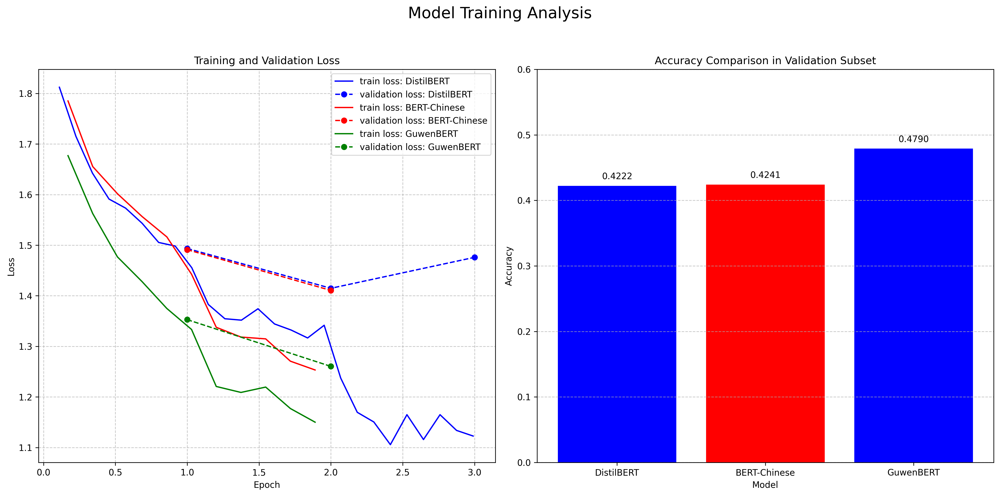
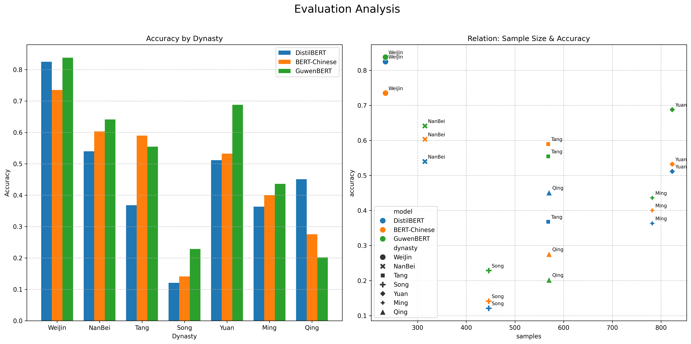

# 詩分唐宋: Poem-Dynasty Classification

This project is part of the "Corpus Processing Tools" course for the Master 1 Plurital program.

## Environment Management

This project uses `uv` for environment management.

To run the scripts (ensure `uv` is installed):
```bash
uv run path/to/the/script.py
```

## Project Objective

The objective of this project is to perform text classification on a corpus of classical Chinese poems (excluding *ci(词)* and *qu(曲)* forms). The goal is to predict the dynasty (in chronological order: WeiJin 魏晋, NanBei 南北朝, Tang 唐, Song 宋, Yuan 元, Ming 明, Qing 清) to which a given poem belongs.

Although the forms of classical Chinese poetry remained relatively stable after the Tang dynasty, this project draws inspiration from two main observations:

1.  **Linguistic**: Linguistic characteristics and word usage show distinct variations from one dynasty to another.

2.  **Stylistic and Literary Theory**: In stylistics and according to ancient Chinese literary theory, the poetry of each dynasty possesses a distinctive style, often described as a "zeitgeist."

## Data

The project data comes from the *sou-yun.cn* website, which does not prohibit data extraction.

This site has already classified poems by dynasty and provides an index of all poems by author. Therefore, the project uses `request` and `bs4` to parse the site's HTML structure and extract poetic data from the seven selected dynasties. For efficiency during training, the extraction script retrieves the first 20 poems from each poet (or the maximum available if less than 20) for dynasties with fewer than 1000 poets, and only the first 20 poems from the first 1000 poets for more prolific dynasties.

The obtained data is saved in `.csv` format, then merged into a single large dataset which is then shuffled and split into three subsets: training/validation/test (according to a **7 : 1.5 : 1.5** ratio, with an actual data distribution of **17418 : 3733 : 3738**). These datasets are stored in HuggingFace dataset format.

| Dataset    | Ratio | Actual Quantity |
|------------|-------|-----------------|
| Training   | 7     | 17 418          |
| Validation | 1.5   | 3 733           |
| Test       | 1.5   | 3 738           |
| **Total**  | **10**| **24 889**      |

Data visualization is presented below:


The first two dynasties (Weijin and Nanbei) show the smallest number of poems, which is logical as they are the oldest dynasties and thus have the fewest preserved works. The Weijin dynasty shows the highest average poem length, as in our corpus, **fu** 赋 are also considered poems. During this period, the creation of four-character poems and **fu** was proportionally more frequent than in the other six dynasties. The latter, particularly after the Tang dynasty, favored the poetic forms **jueju** 绝句 (24 or 32 characters, including punctuation) and **lüshi** 律诗 (48 or 64 characters). Considering that ancient-style poems and "fu" were occasionally created and are much longer than "jueju" and "lüshi," the average length obtained (60-80 characters) seems reasonable.

## Training

This project uses the [HuggingFace Text Classification](https://huggingface.co/docs/transformers/en/tasks/sequence_classification) as a reference for fine-tuning text classification models.

The dataset was trained on three pre-trained BERT-type models:

1. `distilled-bert-multilingual`: a distilled multilingual BERT model, allowing for fast training
2. `bert-case-chinese`: a BERT model for Chinese
3. `ethanyt/guwenbert-base`: a model based on bert-case-chinese that has already been fine-tuned on a large corpus of classical Chinese texts

The number of epochs for the first model is set to 3. To reduce training time, it is set to 2 for the two larger models. The other parameters remain unchanged.

By analyzing the log journals during training, the evolution of loss per epoch and the performance of each model on the validation set were obtained:



It can be observed that the loss trend of the three models is broadly similar, and that `bert-case-chinese` and `ethanyt/guwenbert-base` show an almost parallel evolution — which can be explained by the fact that the latter was fine-tuned from the former. Another interesting fact is that, for `distillBERT`, the validation loss increases after the second epoch; however, due to lack of time and resources, it was not possible to observe this phenomenon on the two larger models.

## Evaluation

After training the three models, an evaluation was performed on the test subset. The `classification_report` class from `sklearn` is used to obtain a more detailed evaluation of the classification tasks.

For the `distilled-bert-multilingual` model, we have:

| Dynasty  | Precision | Recall  | F1-score | Support |
|----------|-----------|---------|----------|---------|
| WeiJin   | 0.5627    | 0.8248  | 0.6690   | 234     |
| NanBei   | 0.5986    | 0.5397  | 0.5676   | 315     |
| Tang     | 0.4953    | 0.3680  | 0.4222   | 568     |
| Song     | 0.3553    | 0.1211  | 0.1806   | 446     |
| Yuan     | 0.4140    | 0.5115  | 0.4576   | 823     |
| Ming     | 0.3389    | 0.3632  | 0.3506   | 782     |
| Qing     | 0.3768    | 0.4509  | 0.4105   | 570     |
| **accuracy** |           |         | 0.4248   | 3738    |
| **macro avg** | 0.4488    | 0.4542  | 0.4369   | 3738    |
| **weighted avg** | 0.4228    | 0.4248  | 0.4121   | 3738    |

<br>

For the `bert-case-chinese` model, we have:

| Dynasty      | Precision | Recall  | F1-score | Support |
|--------------|-----------|---------|----------|---------|
| WeiJin       | 0.6565    | 0.7350  | 0.6935   | 234     |
| NanBei       | 0.5994    | 0.6032  | 0.6013   | 315     |
| Tang         | 0.4110    | 0.5898  | 0.4845   | 568     |
| Song         | 0.3103    | 0.1413  | 0.1941   | 446     |
| Yuan         | 0.4183    | 0.5322  | 0.4684   | 823     |
| Ming         | 0.3789    | 0.4003  | 0.3893   | 782     |
| Qing         | 0.5858    | 0.2754  | 0.3747   | 570     |
| **accuracy** |           |         | 0.4462   | 3738    |
| **macro avg**| 0.4800    | 0.4682  | 0.4580   | 3738    |
| **weighted avg** | 0.4518 | 0.4462 | 0.4326   | 3738    |

<br>

For the `ethanyt/guwenbert-base` model, we have:

| Dynasty      | Precision | Recall  | F1-score | Support |
|--------------|-----------|---------|----------|---------|
| WeiJin       | 0.7626    | 0.8376  | 0.7984   | 234     |
| NanBei       | 0.7953    | 0.6413  | 0.7100   | 315     |
| Tang         | 0.5686    | 0.5546  | 0.5615   | 568     |
| Song         | 0.4163    | 0.2287  | 0.2952   | 446     |
| Yuan         | 0.4060    | 0.6877  | 0.5106   | 823     |
| Ming         | 0.3853    | 0.4361  | 0.4091   | 782     |
| Qing         | 0.7718    | 0.2018  | 0.3199   | 570     |
| **accuracy** |           |         | 0.4914   | 3738    |
| **macro avg**| 0.5866    | 0.5125  | 0.5150   | 3738    |
| **weighted avg** | 0.5385 | 0.4914 | 0.4771   | 3738    |

<br>

By representing the Recall for each dynasty — i.e., the rate of correct predictions for poems from each dynasty — in a graph, the obtained results are interesting:



The `ethanyt/guwenbert-base` model, specialized in classical Chinese, generally shows the best performance with an accuracy of 0.4914 and an average macro F1-score of 0.5150. It is followed by bert-case-chinese (accuracy 0.4462, F1-macro 0.4580) and then distilled-bert-multilingual (accuracy 0.4248, F1-macro 0.4369).

Poems from the **WeiJin** dynasty likely possess very distinctive linguistic or stylistic characteristics that make them easier for the models to identify.

The difficulty in correctly classifying poems from the **Song** dynasty could indicate that their stylistic traits are less unique, or that they share more similarities with poems from adjacent dynasties (Tang, Yuan, Ming), making the distinction more complex even for a specialized model.

The weaker performance of the `ethanyt/guwenbert-base` model on **Qing** poetry might suggest that the characteristics on which this model was fine-tuned (specific to older "classical" Chinese) are less predominant or discriminating for Qing poetry, or that Qing poetry exhibits greater stylistic heterogeneity not effectively captured.

## Standard

The code for this project was reviewed with `pycodestyle` to ensure its compliance with PEP 8.